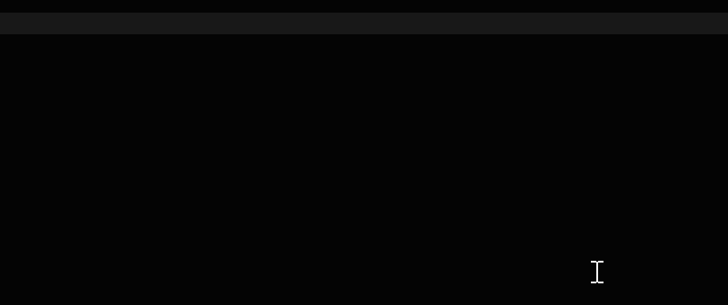

# Dataform/SQL Project for YouTube data

## Querying the Database
- Install [JetBrains Datagrip](https://www.jetbrains.com/datagrip/)
- In DataGrip, add a new Snowflake Datasource with the following details


    **Host:** `ql98184.west-us-2.azure.snowflakecomputing.com` <br />
    **User/Password:** This will be provided<br />
    **Databse**: `yt`<br />
    **Schema**: `public`<br />

- You should now be able to query. e.g.:

```sql
select * from channel_latest limit 10
```

The advantage of Datagrip, is that it provides schema aware autocomplete with snowflake specific functions and syntax.




## Dataform Project
Dataform is a tool to transform data within a warehouse using SQL. `/definitions` Contains SQL with additional Dataform metadata to process the data in it. 

*NOTE:*  This is only needed when you want to create standard shared table, often you can just query the databse with SQL without needing to create permanent tables.

If you have been given access, log into [Dataform](https://app.dataform.co/) and you should be able to open the `YT` project.

**How it works**

Recfluence collects YouTube data daily, and loads this into `*_stage` tables in this database. Recfluence then run's this project to update all tables tagged as `standard`. The up to date dta is queried fora  variety of purposes:
- Ah-hoc SQL for reports
- Standard Tableau reports
- Extracting to blob data for use by sites (e.g. data for [transparency.tube](https://transparency.tube) or [recfluence.net](https://recfluence.net/)


## Schema

### Table conventions:

**`*_stage`**
These are tables with a single `v` column containing JSON. This is where raw data lands from recfluence. They may have inconsistencies, duplicate rows and performance issues querying it directly.

**`*_latest`**
These are tables with the latest data for a historical record. For example, `channel` many rows for the same channel representing what it was at a point in time, and `channel_latest` contains one row per channel with the most recently updated data.


### Table Help/Descriptions
Descriptions for tables are defined in `.sqlx` files and saync'ed as comments on tables by dataform (and by the recfluence CLI). These appear as tooltips in datagrip and any good sql tool.


### Example Queries

```sql

/* most watched political videos for Jan 2021 with their channels tag's */
select v.video_id, c.channel_title, v.video_title, c.tags
from video_latest v
join channel_latest c on c.channel_id = v.channel_id
where c.meets_review_criteria -- only political channels
  and v.upload_date between '2021-01-01' and '2021-02-01'
order by v.views desc nulls last

/* count of channels by tag */
select 
t.value::string tag -- get the tag value from the flatten result. :: is shorthand for casting the type
, count(distinct channel_id) tags
from channel_latest
  , table(flatten(tags)) t -- tags is an array. flatten creates a a row for each tag 
group by 1 -- snowflake supports grouping by position
order by tags desc


```


